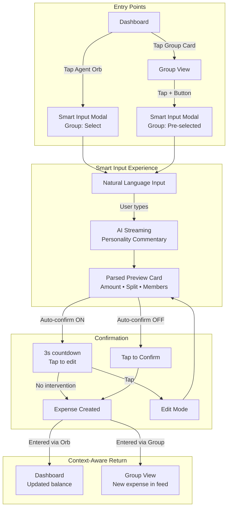
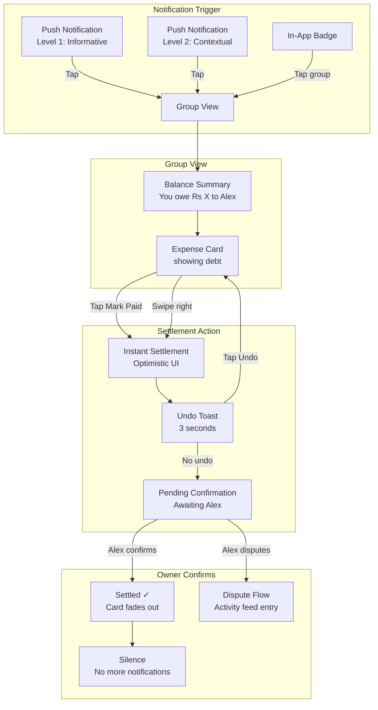

# UX Design Specification: ClearDues

**Author:** Aheedtahir
**Date:** 2026-01-12

---

## Executive Summary

### Project Vision

ClearDues reimagines expense management as **relationship management**. It's not a calculator app — it's an Agentic Mediator that handles the social awkwardness of shared money. The core design principle: **Payment = Silence**. Success is measured by the app's graceful disappearance from users' lives when debts are settled.

### Target Users

**The Organizer (Lender)**
The person who pays, dreads the admin, and hates feeling like a nag. They want frictionless input and automatic follow-up so they never have to "ask" for their money.

**The Borrower (Forgetful Friend)**
The person who owes, forgets, and feels anxious about unstructured debt. They want clear, non-judgmental communication telling them exactly what to pay and when.

**The Passive Member**
The silent group member who rarely adds expenses and is first to uninstall. All UX decisions must pass the test: "Will this annoy the passive member?"

### Key Design Challenges

1. **The Nag Paradox** — Remind without harassing. The progressive notification system must feel helpful, never pushy.

2. **Trust Calibration** — Users must trust AI parsing enough to not constantly edit. Requires transparent preview, easy correction, and visible confidence.

3. **Emotional Neutrality** — Money is emotional. The UI must feel calm, neutral, professional — never judgmental or anxiety-inducing.

4. **Passive Member Retention** — Make the experience valuable for people who mostly owe, not just those who are owed.

### Design Opportunities

1. **"Payment = Silence" UX Pattern** — Use element removal as positive feedback. Settlement clears the screen. Silence is the reward.

2. **Mediator Voice** — Establish a distinct, neutral tone that speaks as a helpful third party, not as the user's voice.

3. **The Speed Moment** — The <15 second Smart Input experience is the viral differentiator. Design to showcase this magic.

4. **Distinctive Identity** — Break from fintech visual clichés. ClearDues has a unique concept deserving unique aesthetics.

## Core User Experience

### Defining Experience

ClearDues is defined by one magical moment: **the Smart Input experience**. A user types "Paid 150 for dinner, exclude Tom" and within 15 seconds has a confirmed expense with automatic splits calculated. This is the core loop that makes ClearDues different — natural language in, structured data out, relationship friction eliminated.

The experience hierarchy:
1. **Add Expense** — The flagship interaction, must feel effortless
2. **Check Balance** — Dashboard glance, instant clarity
3. **Settle Up** — One tap to resolution, immediate feedback

### Platform Strategy

**Mobile-First PWA** optimized for:
- Touch-first interaction (thumb-zone navigation)
- Glanceable information (2-second comprehension)
- One-handed operation (bottom-anchored actions)
- Offline resilience (read + manual write when disconnected)
- Sub-1.5s load time on 4G networks

PWA chosen over native for:
- Zero friction installation (no app store)
- Cross-platform consistency
- Instant updates without user action
- Lower development overhead for MVP

### Effortless Interactions

**Zero-Friction Targets:**
- Add expense: Natural language → Confirm → Done (no forms)
- Check status: Open app → See balance (no navigation)
- Settle debt: Tap "Paid" → Confirmation sent (no payment integration)
- Join group: Click link → In group (no codes)

**Automation Responsibilities:**
- AI parses expense text without manual field entry
- System sends reminders without user initiation
- Balances calculate in real-time
- Split logic applies based on group context

### Critical Success Moments

**First Expense Magic** — The onboarding moment where AI correctly parses natural language input. User realizes "this actually understands me." Trust established.

**The Relief of Non-Asking** — User adds expense, walks away, eventually receives payment notification. They never had to personally ask anyone. Core value proposition delivered.

**The Clean Slate** — All debts settled, dashboard shows zero balances. Peaceful empty state. The reward of completion.

**Graceful Correction** — AI makes a mistake, user fixes it in one tap, system accepts without friction. Trust preserved through transparency.

### Experience Principles

1. **Speed is the Feature** — Every interaction completes faster than expected. 15 seconds for expense entry is the floor, not the ceiling.

2. **Silence is Success** — The best outcome is the app disappearing. Design for absence, not presence.

3. **Trust Through Transparency** — Every AI decision is visible and editable. No black boxes.

4. **Mobile-Native Design** — Designed thumb-first, glance-first, one-hand-first. Not desktop adapted.

5. **Emotional Neutrality** — Money is emotional; the app is not. Calm, professional, never judgmental.

## Desired Emotional Response

### Primary Emotional Goals

**Core Promise:** Transform the uncomfortable emotions of shared money (guilt, anxiety, awkwardness, resentment) into calm, clarity, and relief.

| Target Emotion | User | Trigger Moment |
|----------------|------|----------------|
| Relief | Organizer | Expense added, burden transferred to system |
| Clarity | Borrower | Viewing exactly what they owe with no ambiguity |
| Trust | All users | Throughout — the system is fair and transparent |
| Calm | All users | Always — money discussions don't trigger anxiety |
| Completion | All users | After settlement — true closure achieved |

**Differentiating Emotion:** While competitors make users feel "organized," ClearDues makes users feel **unburdened**. The system carries the weight.

### Emotional Journey Mapping

**Discovery:** Curious → Impressed ("Wait, that actually worked?")

**Adding Expense:** Quick relief — type, confirm, done. System handles the rest.

**Receiving Notification:** Informed, not pressured. Clear what to do, no guilt attached.

**Settling Up:** Satisfaction → Peace. Item disappears. Silence follows.

**Zero Balance:** Completion and lightness. Nothing hanging over me.

**Error/Correction:** Confident, not embarrassed. Easy fix, system accepts gracefully.

### Micro-Emotions

**To Cultivate:**
- Confidence (clear AI previews)
- Control (always editable)
- Fairness (transparent math)
- Respect (mediator tone)
- Closure (visible finality)

**To Prevent:**
- Guilt (avoid "you owe" framing)
- Shame (private balances)
- Anxiety (progressive, snooze-able reminders)
- Frustration (2-3 taps maximum)
- Distrust (visible audit trails)

### Design Implications

- **Relief:** Immediate confirmation, "handed off" indicators, no follow-up required
- **Clarity:** Single balance number, clear owe/owed distinction, no mental math
- **Trust:** Show AI interpretation before confirm, activity feed, edit history
- **Calm:** Neutral colors, soft typography, mediator voice
- **Completion:** Settlement celebration, items fade when resolved, rewarding empty state

### Emotional Design Principles

1. **The System Absorbs Awkwardness** — Notifications come from ClearDues, not from "Alex." The system preserves relationships.

2. **Numbers Without Judgment** — Display amounts as facts, not accusations. "$50" not "You still owe $50!"

3. **Silence as Reward** — The absence of notifications IS the reward. Don't fill it with unnecessary confirmation.

4. **Graceful Degradation of Tension** — Progressive notifications start and stay gentle. Escalation is last resort.

5. **Private by Default** — Individual debts are between user and system. Group sees totals, not specifics.

## UX Pattern Analysis & Inspiration

### Inspiring Products Analysis

**Linear** — Speed-first design, professional tone, clean hierarchy without sacrificing power. Their "instant everything" philosophy aligns with our 15-second goal.

**Things 3** — Completion satisfaction through graceful item removal. Their "done" state IS the reward — directly maps to "Payment = Silence."

**Venmo** — Made money casual. One-tap actions, distinctive identity. Caution: their public feed creates unwanted social pressure.

**Arc Browser** — Proof that "solved" categories can be reimagined with bold, distinctive design. Confidence in unconventional choices.

**ChatGPT** — Set user expectations for natural language. AI transparency through editable outputs and visible reasoning.

### Transferable UX Patterns

**Navigation:**
- Bottom tab bar with floating action button for quick expense add
- Swipe actions on list items (settle, edit, archive)
- Command palette for power users (`Cmd+K` pattern)

**Interaction:**
- Natural language input as primary entry method
- Streaming/typing indicator during AI parsing
- Swipe-to-complete for settlement actions
- Haptic feedback on confirmations

**Visual:**
- Calm, neutral palette (no anxiety-inducing reds)
- Single accent color for actions
- Generous white space for clarity
- Fade-out animations on completion
- Monospace typography for amounts

### Anti-Patterns to Avoid

**Form Fatigue** — Multi-field forms kill speed. Avoid Splitwise's step-by-step entry.

**Anxiety Colors** — No red for negative balances. Display debt as neutral fact.

**Public Shame** — No activity feeds showing who owes what to whom publicly.

**Notification Spam** — Progressive, contextual reminders only. Never train users to ignore.

**Visual Clichés** — No green = money, no dollar sign icons, no generic fintech aesthetics.

### Design Inspiration Strategy

**Adopt:**
- Linear's speed-first interaction model
- Things 3's completion-through-absence satisfaction
- Arc's confidence in distinctive visual identity
- ChatGPT's AI transparency patterns

**Adapt:**
- Venmo's casual tone → professional mediator voice
- Linear's information density → mobile-simplified
- Things 3's gesture vocabulary → primary actions only

**Avoid:**
- Splitwise's form-heavy patterns
- Red/green money color coding
- Public social features
- Notification overload
- Generic fintech visual language

## Design System Foundation

### Design System Choice

**Selected:** shadcn/ui + Tailwind CSS

**Architecture Update:** Replacing Chakra UI (original architecture choice) with shadcn/ui to better support the "distinctive identity" and "minimal but beautiful" design requirements established in this UX specification.

### Rationale for Selection

1. **Full Ownership** — Components live in codebase, not as dependencies. Complete control over appearance and behavior.

2. **Distinctive Identity** — Unlike opinionated systems (Material, Chakra), shadcn provides unstyled primitives that won't create a "recognizable look."

3. **Accessibility Foundation** — Built on Radix UI primitives with world-class keyboard, screen reader, and focus management support.

4. **Performance** — Only ship components actually used. No bundle bloat from unused features.

5. **Tailwind Integration** — Maximum styling flexibility through utility classes. Perfect for rapid iteration and customization.

6. **Modern Standard** — The dominant approach in React ecosystem (2025-2026), ensuring community support and long-term viability.

### Implementation Approach

**Initialization:**
- Initialize shadcn/ui with Tailwind CSS in existing Vite + React + TypeScript setup
- Configure path aliases and component output directory
- Set up CSS variables for design tokens

**Core Component Set:**
- Button, Input, Card, Dialog, Sheet, Toast, Avatar, Badge, Skeleton
- Additional components added as needed during feature development

**Mobile-First Configuration:**
- Default to mobile breakpoint
- Touch-optimized component variants (larger targets, swipe gestures)
- Bottom-anchored action patterns

### Customization Strategy

**Design Tokens (CSS Variables):**
- ClearDues color palette (calm, neutral, single accent)
- Typography scale (system fonts for performance)
- Spacing scale (generous white space)
- Border radius (soft, approachable corners)
- Shadow system (subtle depth)

**Component Extensions:**
- ExpenseCard — specialized card with swipe actions
- SmartInput — natural language input with AI feedback
- BalanceDisplay — monospace numbers, neutral styling
- NotificationItem — progressive urgency visual states

**Animation System:**
- Fade-out-on-completion for settlement satisfaction
- Subtle micro-interactions for confirmations
- Loading states with skeleton patterns
- Page transitions for navigation flow

**Accessibility Enforcement:**
- All interactive elements keyboard accessible
- Focus visible states clearly defined
- Color contrast WCAG AA minimum
- Screen reader announcements for dynamic content

## Core Experience: Smart Input with Personality

### The Signature Interaction

ClearDues' defining experience is the **Smart Input flow**: user types natural language → AI streams personality-driven commentary → expense confirmed in under 15 seconds.

This transforms expense entry from tedious data entry into an entertaining micro-moment. The processing time isn't dead time — it's personality time.

**The Magic Formula:**
> Natural language input + AI personality streaming + instant split calculation = relationship friction eliminated

### User Mental Model

**Current Pain Points (what we're replacing):**
- **Memory:** Tracking who's included/excluded, dividing amounts mentally, forgetting details
- **Spreadsheets:** Clicking each cell, manual data entry, double-checking for errors, tedious and error-prone
- **Existing apps:** Form fatigue, multi-step flows, no personality, feels like accounting

**User Expectation:**
Users arrive trained by ChatGPT — they expect natural language to "just work." ClearDues meets this expectation and exceeds it with personality-driven feedback that makes the wait enjoyable.

### Success Criteria

| Criteria | Target | Why It Matters |
|----------|--------|----------------|
| Parse accuracy | >90% no-edit submissions | Trust established on first use |
| Speed perception | <15s with engaging stream | Never feels like waiting |
| Personality delight | High personality usage per group | Users actively choose entertainment |
| Confidence signal | Low "edit after confirm" rate | Users trust AI interpretation |
| Zero mental math | 100% auto-calculated splits | Core value proposition delivered |

### AI Personality System

**Per-Group Customization:**
Each group selects its own AI personality, matching the social dynamic:

| Mode | Tone | Use Case | Example |
|------|------|----------|---------|
| Professional | Neutral, efficient | Work colleagues, formal groups | "Processing dinner expense... Split calculated: Rs 375 each" |
| Friendly | Warm, encouraging | Family, close friends | "Nice dinner! Splitting Rs 1,500 among 4... Everyone owes Rs 375 ✨" |
| Funny | Light humor | Casual friend groups | "Another dinner? You guys eat like royalty. Rs 375 each, your highness." |
| F3-PBS (Roast) | Unhinged, savage, no limits | Roommates, best friends who roast | "Rs 1,500 for fries?! Did you eat the whole potato farm? Rs 375 each, chunky." |

**F3-PBS Warning:**
Roast mode comes with explicit opt-in warning: "This mode is unhinged. Dark humor, savage roasts, no boundaries. You asked for this."

### Experience Mechanics

**1. Initiation:**
- User taps floating action button or Smart Input field
- Keyboard opens with natural language placeholder: "Paid 150 for dinner, split with everyone except Tom"
- Previous inputs shown as suggestions for quick repeat entries

**2. Interaction:**
- User types/speaks natural language expense description
- Taps send or presses enter
- AI processing begins immediately

**3. Streaming Feedback (ChatGPT-style):**
- Character-by-character streaming based on group's selected personality
- Commentary acknowledges the expense while calculating
- Streaming creates engagement during processing time
- Visual: typing indicator → streaming text → final result card

**4. Confirmation:**
- Parsed expense shown as structured preview card
- Split amounts displayed per person
- **User preference setting:**
  - Auto-confirm: Result confirms after 3 seconds if no intervention
  - Manual confirm: Always requires tap to confirm
- Edit option clearly visible for corrections

**5. Completion:**
- Success state with satisfying micro-animation
- Expense card appears in activity feed
- Notifications queued for involved members
- Screen ready for next action or dismissal

### Novel UX Patterns

| Innovation | Description | Competitive Advantage |
|------------|-------------|----------------------|
| Per-group AI personality | Each group has its own AI tone | No expense app offers this |
| Roast mode for finances | Unhinged commentary on spending | Completely unique in fintech |
| Entertaining wait states | Processing time becomes content | Transforms liability into feature |
| Streaming expense parsing | Real-time AI feedback while calculating | Builds trust through transparency |

**Pattern Strategy:**
- **Leverage established:** Natural language input (ChatGPT-trained users), streaming text (familiar mechanic)
- **Innovate on top:** Add personality layer that no competitor has attempted
- **Result:** Feels intuitive but delightfully surprising

## Visual Design Foundation

### Color System

**Philosophy:** Warm Minimal with Soft Neutrals — calm, non-judgmental, human rather than "fintech."

**Base Palette:**

| Token | Role | Value (Light) | Value (Dark) |
|-------|------|---------------|--------------|
| `background` | Page background | Warm white (#FDFBF7) | Deep charcoal (#1A1A1A) |
| `surface` | Cards, containers | Soft cream (#FAF8F5) | Dark gray (#252525) |
| `surface-elevated` | Modals, sheets | Pure white (#FFFFFF) | Elevated gray (#2E2E2E) |
| `border` | Dividers, outlines | Sand (#E8E4DD) | Muted (#3A3A3A) |
| `text-primary` | Main content | Warm black (#1F1E1C) | Off-white (#F5F5F5) |
| `text-secondary` | Supporting text | Warm gray (#6B6660) | Muted gray (#A0A0A0) |
| `text-muted` | Hints, placeholders | Light gray (#9C9790) | Dim gray (#707070) |

**Accent Colors:**

| Token | Role | Value | Usage |
|-------|------|-------|-------|
| `action` | Primary actions, CTAs | Muted teal (#3D9A94) | Buttons, links, interactive elements |
| `action-hover` | Hover state | Deeper teal (#2D7A75) | Button hover, link hover |
| `success` | Completion, settlement | Warm amber (#D4A857) | Success states, "paid" indicators, completion |
| `success-subtle` | Background highlight | Amber tint (#FDF8ED) | Success card backgrounds |

**Semantic Colors:**

| Token | Role | Value | Notes |
|-------|------|-------|-------|
| `info` | Informational | Soft blue (#5B8FB9) | Notifications, tips |
| `warning` | Attention needed | Muted orange (#CC8B4D) | Reminders, due dates |
| `error` | Errors only | Soft coral (#C97C7C) | Form errors, failures — never for debt |

**Critical Rule:** Debt/owe amounts are NEVER shown in red or warning colors. All amounts are displayed in neutral `text-primary` — money is fact, not judgment.

### Typography System

**Font Family:** Inter (Geometric Sans)
- Clean, modern, highly legible
- Excellent screen rendering
- Variable font support for performance

**Type Scale:**

| Token | Size | Weight | Line Height | Usage |
|-------|------|--------|-------------|-------|
| `display` | 32px | Medium (500) | 1.2 | Dashboard balance |
| `title` | 24px | Medium (500) | 1.3 | Page titles |
| `heading` | 18px | Medium (500) | 1.4 | Section headers |
| `body` | 16px | Regular (400) | 1.5 | Default text |
| `body-small` | 14px | Regular (400) | 1.5 | Secondary content |
| `caption` | 12px | Regular (400) | 1.4 | Labels, timestamps |

**Number Display:**
- Proportional figures (not tabular) — flows naturally with text
- Same font family (Inter) for consistency
- **Currency format:** Always "Rs" prefix, never "₹" symbol
- Example: "Rs 1,500" not "₹1,500"

**Weight Strategy:** Subtle hierarchy
- Regular (400) for body text
- Medium (500) for emphasis and headings
- No bold/black weights — keeps the calm, quiet tone

### Spacing & Layout Foundation

**Base Unit:** 4px grid system

| Token | Value | Usage |
|-------|-------|-------|
| `space-1` | 4px | Tight gaps, icon padding |
| `space-2` | 8px | Related elements |
| `space-3` | 12px | Component internal padding |
| `space-4` | 16px | Standard spacing |
| `space-5` | 20px | Section gaps |
| `space-6` | 24px | Card padding |
| `space-8` | 32px | Major section breaks |
| `space-12` | 48px | Page-level spacing |

**Density:** Comfortable
- Balanced padding that doesn't feel cramped or wasteful
- Touch targets minimum 44px height
- Generous but not excessive white space

**Corner Radius:** Soft (8-12px)

| Token | Value | Usage |
|-------|-------|-------|
| `radius-sm` | 6px | Buttons, inputs, chips |
| `radius-md` | 10px | Cards, containers |
| `radius-lg` | 16px | Modals, sheets |
| `radius-full` | 9999px | Avatars, pills |

**Shadow System:** Subtle depth

| Token | Value | Usage |
|-------|-------|-------|
| `shadow-sm` | 0 1px 2px rgba(0,0,0,0.05) | Subtle lift |
| `shadow-md` | 0 4px 12px rgba(0,0,0,0.08) | Cards, elevated content |
| `shadow-lg` | 0 8px 24px rgba(0,0,0,0.12) | Modals, sheets |

### Theme Mode Strategy

**System-Default Preference:**
- App follows device light/dark preference automatically
- No manual toggle required (reduces UI complexity)
- Ensures ClearDues feels native and considerate
- Both themes equally designed — dark mode not an afterthought

**Transition:** Smooth 200ms color transitions when theme changes

### Accessibility Considerations

**Contrast Compliance:**
- All text meets WCAG AA (4.5:1 for body, 3:1 for large text)
- Interactive elements clearly distinguishable
- Focus states visible and consistent

**Color Independence:**
- Meaning never conveyed by color alone
- Icons, labels, or patterns accompany color indicators
- Debt/credit distinguished by labels, not red/green

**Touch Targets:**
- Minimum 44x44px for all interactive elements
- Adequate spacing between tap targets
- Swipe gestures have generous activation areas

**Motion:**
- Respects `prefers-reduced-motion` setting
- Essential animations only (confirmation, completion)
- No decorative motion that could cause discomfort

## Design Direction Decision

### Design Directions Explored

Six distinct design directions were generated and evaluated:

1. **Classic Bottom Nav** — Familiar mobile pattern with FAB, but felt too typical for an agent-focused product
2. **Chat-First Input** — Excellent AI personality showcase, but header and scrollbar needed refinement
3. **Card Stack Dashboard** — Smart overview of all groups, clean and intuitive
4. **Minimal List View** — Discarded (too people-centric, lost group context)
5. **Side Panel Groups** — Discarded (power-user focused, too complex for mobile-first)
6. **Full-Screen Smart Input** — Excellent focus on the 15-second magic moment, works best as modal

### Chosen Direction: Hybrid Approach

A layered architecture combining the best elements from directions 1, 2, 3, and 6:

**Layer 1: Dashboard (Card Stack)**
- All groups displayed as interactive cards
- Total balance across all groups prominently shown
- Quick actions (Add Expense, Settle Up) directly on each card
- FAB available for quick expense entry without selecting group first
- Settled groups visually distinct with amber success styling

**Layer 2: Group View (Chat-Style Feed)**
- Accessed by tapping a group card
- Chat-like expense feed with AI personality streaming inline
- Clean header with back navigation and group name
- Balance for selected group displayed
- Add Expense button triggers full-screen modal

**Layer 3: Smart Input Modal (Full-Screen)**
- Slides up as full-screen modal
- Maximum focus on the signature 15-second experience
- AI preview builds in real-time with personality commentary
- Split calculations visible before confirmation
- Confirms expense and returns to group view

**Navigation: Hidden Bottom Nav**
- Bottom navigation hidden by default for content-first experience
- Small translucent pill icon in corner (game HUD inspired)
- Tap to reveal full navigation (Home, Groups, Activity, Profile)
- Auto-hides after selection or 3-second timeout
- Optional swipe-up gesture to reveal
- Reduces visual distraction, keeps focus on content

### Design Rationale

**Why This Hybrid Works:**

1. **Agent-First Feel** — The chat-style group view and streaming AI preview make the agentic nature front and center, unlike traditional expense apps

2. **Progressive Disclosure** — Dashboard gives overview, group view gives detail, modal gives focus. Each layer serves a distinct purpose

3. **Distraction-Free** — Hidden navigation follows the "Payment = Silence" philosophy. The app stays out of the way until needed

4. **Speed Optimized** — FAB on dashboard allows immediate expense entry. Full-screen modal provides maximum focus for the core experience

5. **Scalable** — Works for users with 1 group or 10 groups. Card stack scales naturally

### Implementation Approach

**Screen Hierarchy:**
```
App Shell
├── Dashboard (default view)
│   ├── Header (greeting, total balance)
│   ├── Group Cards (scrollable)
│   ├── FAB (quick add)
│   └── Hidden Nav Trigger
├── Group View (drill-down)
│   ├── Header (back, group name, add button)
│   ├── Balance Summary
│   ├── Expense Feed (chat-style)
│   └── Hidden Nav Trigger
├── Smart Input Modal (overlay)
│   ├── Close button
│   ├── Group selector
│   ├── Natural language input
│   ├── AI Preview area
│   └── Confirm button
└── Hidden Bottom Nav (expandable)
    ├── Home
    ├── Groups
    ├── Activity
    └── Profile
```

**Transition Animations:**
- Dashboard → Group View: Slide right with card expansion
- Group View → Dashboard: Slide left
- Add Expense → Modal: Slide up from bottom
- Modal dismiss: Slide down
- Nav expand: Slide up with backdrop fade

**Component Reuse:**
- Expense cards shared between dashboard quick-view and group feed
- Balance display component with consistent styling
- AI streaming component reused in modal and inline contexts
- Hidden nav trigger consistent across all screens

## User Journey Flows

### Platform Strategy: Mobile-First PWA with Desktop Adaptation

**Primary Platform:** Mobile-First Progressive Web App (PWA)

| Aspect | Mobile | Desktop |
|--------|--------|---------|
| **Primary Input** | Touch gestures | Click + keyboard |
| **Navigation** | Swipe right to go back | Click back / keyboard shortcut |
| **Card Actions** | Swipe left/right | Hover reveals buttons |
| **Modals** | Bottom sheet (full-screen) | Centered dialog |
| **Layout** | Single column stack | Potential multi-panel |

**Gesture Support (Mobile):**

| Gesture | Action | Fallback |
|---------|--------|----------|
| Swipe right (screen) | Go back | Back arrow button |
| Swipe left (card) | Reveal inline edit | Tap card for modal |
| Swipe right (card) | Quick "Mark Paid" | Tap Mark Paid button |
| Pull down | Refresh | Refresh button |
| Tap + hold | Context menu | Three-dot menu |

**Responsive Breakpoints:**

| Breakpoint | Layout | Target |
|------------|--------|--------|
| < 640px | Mobile stack | Phones (primary) |
| 640-1024px | Tablet adaptive | iPads, small laptops |
| > 1024px | Desktop enhanced | Laptops, desktops |

**Desktop Enhancements:**
- Keyboard shortcuts (`Cmd/Ctrl + N` for new expense, `Escape` to close)
- Hover states reveal actions instead of requiring swipe
- Wider layouts with potential side-by-side panels
- Same design tokens and visual identity maintained

### The Agent Orb: Distinctive Action Trigger

The FAB (Floating Action Button) is reimagined as the **Agent Orb** — a game-inspired visual embodiment of the AI mediator.

**Visual Design:**

| Attribute | Specification |
|-----------|---------------|
| Shape | Soft rounded square (squircle) |
| Size | 56-64px |
| Color | Muted teal (`action`) with inner gradient |
| Position | Bottom-right, elevated |
| Glow | Soft ambient pulse (2-3s cycle) |

**States:**

| State | Visual | Meaning |
|-------|--------|---------|
| Idle | Gentle pulse glow (opacity 0.6→1.0→0.6) | Ready to help |
| Tapped | Quick scale up (1.0→1.1) + ripple | Acknowledged |
| Processing | Faster pulse | AI working |
| Success | Warm amber flash | Done! |

**Animation:**
```
Idle Animation:
  - Soft glow pulses (opacity 0.6 → 1.0 → 0.6)
  - Subtle "breathing" scale (1.0 → 1.02 → 1.0)
  - Feels alive, not mechanical

On Tap:
  - Quick scale up (1.0 → 1.1)
  - Ripple effect outward
  - Modal slides up from orb position
```

**Design Rationale:**
- Embodies the Agentic Mediator concept visually
- Distinctive — no other expense app has this
- Game HUD inspired — matches hidden nav pill aesthetic
- Conversation starter for viral loop potential

### Journey 1: Add Expense Flow

**Hybrid Entry Approach:** Users can add expenses from Dashboard (via Agent Orb) or from within a Group View (via + button). Both paths lead to the Smart Input Modal.

**Entry Points:**

| Entry Point | Group Selection | Return Destination |
|-------------|-----------------|-------------------|
| Dashboard Agent Orb | Select in modal | Dashboard |
| Group View + button | Pre-selected | Group View |

**Flow Diagram:**



**Interaction Details:**

| Step | Action | Feedback |
|------|--------|----------|
| Tap Agent Orb | Orb pulses, expands | Modal slides up from orb position |
| Type expense | Keyboard + input field | Placeholder: "Paid 150 for dinner..." |
| AI processing | Streaming text appears | Personality commentary builds character-by-character |
| Preview shown | Structured card | Amount, split logic, member chips visible |
| Confirm | Tap or auto-confirm | Success animation, modal slides down |
| Return | Automatic navigation | Orb flashes amber (success) |

**AI Group Suggestion (Orb Entry):**
When entering via Agent Orb, AI can suggest the most likely group based on:
- Most active group
- Time of day patterns
- Keywords in expense ("roommate" → roommate group)

### Journey 2: Settlement Flow

**From notification to silence — the "Payment = Silence" moment.**

**Flow Diagram:**



**Interaction Details:**

| Step | Action | Feedback |
|------|--------|----------|
| Receive notification | System push | Contextual message, not accusatory |
| Tap notification | Deep-link | Opens directly to relevant Group View |
| View debt | See expense card | Clear "You owe Rs X" with Mark Paid button |
| Mark Paid | Single tap (instant) | Immediate UI update + undo toast (3s) |
| Awaiting confirmation | Pending state | Card shows "Awaiting Alex's confirmation" |
| Confirmed | Owner confirms | Card fades out with amber glow |

**"Payment = Silence" Moment:**
When settlement is confirmed, the expense card fades out with a satisfying amber glow. The balance updates. The reward is the absence of the item — silence achieved.

### Journey 3: Error Correction Flow

**Graceful handling of AI mistakes with dual-mode editing.**

**Edit Mode Selection:**

| Edit Complexity | Interaction | Mode |
|-----------------|-------------|------|
| Change amount | Swipe left | Inline |
| Fix description typo | Swipe left | Inline |
| Change split logic | Tap card | Full Modal |
| Add/remove members | Tap card | Full Modal |
| Change payer | Tap card | Full Modal |

**Flow Diagram:**

```mermaid
flowchart TD
    subgraph Discovery["Error Discovery"]
        G[Group View] --> E[Expense Card<br/>showing wrong split]
        E --> |"User notices error"| D{How to edit?}
    end

    subgraph Edit["Dual Edit Modes"]
        D --> |"Swipe left"| IL[Inline Edit<br/>Quick field changes]
        D --> |"Tap card"| FM[Full Modal<br/>Complete edit control]
    end

    subgraph Inline["Inline Edit Mode"]
        IL --> IF[Edit fields appear<br/>Amount • Split type]
        IF --> |"Change value"| IV[Instant validation]
        IV --> |"Tap checkmark"| S[Save]
    end

    subgraph Modal["Full Edit Modal"]
        FM --> MF[Full expense form<br/>All fields editable]
        MF --> |"Edit split logic"| SP[Split Picker<br/>Equal • Unequal • %]
        MF --> |"Edit members"| MM[Member Selector<br/>Include/Exclude]
        SP --> S
        MM --> S
    end

    subgraph Audit["Transparent Update"]
        S --> R[Recalculation<br/>Instant balance update]
        R --> A[Activity Feed Entry<br/>"Split updated by Alex"]
        R --> T[Toast Confirmation<br/>"Split corrected"]
        A --> TR[Trust Preserved<br/>Transparent audit trail]
    end
```

**Interaction Details:**

| Step | Action | Feedback |
|------|--------|----------|
| Notice error | View expense card | Split amounts visible on card |
| Swipe left | Inline edit activates | Fields become editable in-place |
| Tap card | Full modal opens | Complete control over all fields |
| Edit split | Change logic/members | Real-time recalculation preview |
| Save | Tap checkmark/confirm | Toast: "Split corrected" |
| Audit | Automatic | Activity feed: "Alex updated split: 4-way → 3-way" |

### Journey Patterns

Reusable patterns identified across all user journeys:

**Navigation Patterns:**

| Pattern | Description | Used In |
|---------|-------------|---------|
| Context-Aware Return | Return destination based on entry point | Add Expense |
| Deep-Link to Context | Notifications land directly in relevant view | Settlement |
| Dual-Mode Interaction | Swipe for quick, tap for full control | Error Correction |
| Swipe-to-Navigate | Swipe right on screen to go back | All views |

**Feedback Patterns:**

| Pattern | Description | Used In |
|---------|-------------|---------|
| Optimistic UI | Instant visual update, background sync | Settlement |
| Undo Toast | 3-second window to reverse action | Settlement |
| Streaming Feedback | Character-by-character AI response | Add Expense |
| Fade-Out Completion | Items disappear when resolved | Settlement |

**Trust Patterns:**

| Pattern | Description | Used In |
|---------|-------------|---------|
| Transparent Audit | Every change logged in Activity Feed | Error Correction |
| Confirmation Required | Two-party verification for settlements | Settlement |
| Preview Before Commit | Show parsed result before saving | Add Expense |

### Flow Optimization Principles

1. **Minimum Taps to Value**
   - Add expense: 3 taps (Orb → type → confirm)
   - Mark paid: 1 tap
   - Edit split: 1 swipe + 1 tap

2. **Progressive Disclosure**
   - Simple edits: inline (swipe)
   - Complex edits: modal (tap)
   - Never show all options at once

3. **Contextual Intelligence**
   - AI suggests group based on expense keywords
   - Return to origin after action completion
   - Notifications deep-link to relevant context

4. **Emotional Safety Nets**
   - Undo windows for irreversible actions
   - Preview before commit
   - Clear confirmation states
   - Transparent audit trails

## Component Strategy

### Design System Components

**Selected Design System:** shadcn/ui + Tailwind CSS

**Available Components (with ClearDues customization):**

| Component | ClearDues Usage | Customization |
|-----------|-----------------|---------------|
| Button | Confirm, Cancel, Mark Paid | Custom variants (action, ghost, danger) |
| Input | Text fields, search | Larger touch targets, custom focus ring |
| Card | Base for expense/group cards | Consistent radius/shadow with tokens |
| Sheet | Bottom sheet modals (mobile) | Full-screen on mobile |
| Dialog | Centered modals (desktop) | Consistent with Sheet styling |
| Toast | Undo actions, notifications | Custom undo variant with timer |
| Avatar | Member display, group icons | Size variants for different contexts |
| Badge | Notification counts, status | Custom colors for urgency levels |
| Skeleton | Loading states | Matching card/component shapes |
| Dropdown Menu | Context menus, options | Touch-optimized sizing |

### Custom Components

#### Agent Orb

**Purpose:** Primary action trigger that embodies the AI mediator — the gateway to the 15-second magic moment.

**Anatomy:**
```
┌─────────────────┐
│   ╭─────────╮   │  ← Outer glow (ambient pulse)
│   │ ╭─────╮ │   │  ← Inner squircle (gradient fill)
│   │ │  ✦  │ │   │  ← Optional spark icon (or empty)
│   │ ╰─────╯ │   │
│   ╰─────────╯   │
└─────────────────┘
```

**Specifications:**

| Attribute | Value |
|-----------|-------|
| Shape | Soft rounded square (squircle) |
| Size | 56-64px |
| Color | Muted teal (`action`) with inner gradient |
| Position | Bottom-right, elevated above content |
| Glow | Soft ambient pulse (2-3s cycle) |

**States:**

| State | Background | Glow | Scale | Duration |
|-------|------------|------|-------|----------|
| Idle | Teal gradient | Pulse 0.6→1.0 | Breathe 1.0→1.02 | 2-3s cycle |
| Hover (desktop) | Brighter teal | Steady 1.0 | 1.0 | — |
| Pressed | Deeper teal | Flash | 0.95 | 100ms |
| Processing | Teal | Fast pulse | 1.0 | 500ms cycle |
| Success | Amber flash | Burst outward | 1.1→1.0 | 300ms |
| Disabled | Muted gray | None | 1.0 | — |

**Accessibility:**
- `aria-label="Add new expense"`
- `role="button"`
- Keyboard: `Tab` to focus, `Enter/Space` to activate
- Focus ring visible on keyboard navigation

---

#### Smart Input

**Purpose:** Natural language expense entry with AI streaming feedback above.

**Anatomy:**
```
┌─────────────────────────────────────┐
│  ╭─────────────────────────────╮    │  ← AI Commentary Bubble
│  │ "Another dinner? You guys   │    │    (streams above input)
│  │  eat like royalty..."       │    │
│  ╰─────────────────────────────╯    │
│                                     │
│  ┌─────────────────────────────┐    │  ← Input Field
│  │ Paid 150 for dinner...    ⏎│    │    (with send button)
│  └─────────────────────────────┘    │
│                                     │
│  ┌─────────────────────────────┐    │  ← Preview Card
│  │ Rs 150 • Dinner • 4 people  │    │    (parsed result)
│  │ ○ Alex  ○ Sam  ○ Tom  ○ You │    │
│  └─────────────────────────────┘    │
└─────────────────────────────────────┘
```

**States:**

| State | Input | AI Bubble | Preview |
|-------|-------|-----------|---------|
| Empty | Placeholder visible | Hidden | Hidden |
| Typing | User text | Hidden | Hidden |
| Processing | Disabled | Streaming text | Skeleton |
| Parsed | User text | Complete | Visible with data |
| Error | User text | Error message | Hidden |
| Confirmed | Clearing | Success message | Fade out |

**AI Commentary Bubble:**
- Appears above input when AI starts processing
- Text streams character-by-character (30-50ms per char)
- Background: `surface-elevated` with subtle shadow
- Tail points down toward input
- Personality-dependent content based on group setting

**Accessibility:**
- Input: `aria-label="Describe your expense"`
- AI Bubble: `aria-live="polite"` for screen reader updates
- Preview: Focusable with clear field labels

---

#### Swipeable Card

**Purpose:** Base component enabling swipe gestures for quick actions on cards.

**Anatomy:**
```
Swipe Left (Edit):
┌─────────────────────────────────────┐
│                          ┌────────┐ │
│  [Card Content]          │  Edit  │ │  ← Action revealed
│                          └────────┘ │
└─────────────────────────────────────┘

Swipe Right (Mark Paid):
┌─────────────────────────────────────┐
│ ┌──────────┐                        │
│ │ Mark Paid│  [Card Content]        │  ← Action revealed
│ └──────────┘                        │
└─────────────────────────────────────┘
```

**Behavior:**

| Gesture | Threshold | Action | Feedback |
|---------|-----------|--------|----------|
| Swipe left 30% | Reveal edit | Show edit action | Haptic light |
| Swipe left 60% | Auto-trigger | Open inline edit | Haptic medium |
| Swipe right 30% | Reveal Mark Paid | Show action | Haptic light |
| Swipe right 60% | Auto-trigger | Execute Mark Paid | Haptic success |
| Release < 30% | Snap back | Cancel | None |

**Desktop Fallback:**
- Hover reveals action buttons on right side of card
- No swipe detection on desktop

**Accessibility:**
- Hidden action buttons receive focus after card
- `aria-label` describes available actions
- Keyboard: Arrow keys to reveal, Enter to activate

---

#### Split Picker (Visual Cards)

**Purpose:** Select split logic using visual cards that clearly show the split type.

**Anatomy:**
```
┌─────────────────────────────────────────────────────┐
│  Split Type                                         │
│                                                     │
│  ┌─────────┐  ┌─────────┐  ┌─────────┐  ┌─────────┐│
│  │  ═══    │  │  ───    │  │   %     │  │  ■ ■ ■  ││
│  │  ═══    │  │  ─────  │  │  25%    │  │  ■ ■    ││
│  │  ═══    │  │  ──     │  │  50%    │  │  ■      ││
│  │         │  │         │  │         │  │         ││
│  │ Equal   │  │ Unequal │  │ Percent │  │ Shares  ││
│  └─────────┘  └─────────┘  └─────────┘  └─────────┘│
│   [selected]                                        │
└─────────────────────────────────────────────────────┘
```

**Visual Icons:**
- **Equal:** Three equal horizontal bars
- **Unequal:** Three bars of different lengths
- **Percentage:** "%" symbol with example percentages
- **Shares:** Stacked squares representing share units

**States:**

| State | Border | Background | Icon Color |
|-------|--------|------------|------------|
| Default | `border` | `surface` | `text-secondary` |
| Hover | `action` | `surface` | `text-primary` |
| Selected | `action` (2px) | `action/10` tint | `action` |
| Disabled | `border` muted | `surface` | `text-muted` |

**Accessibility:**
- `role="radiogroup"` for the container
- `role="radio"` for each card
- Arrow keys navigate between options
- Clear labels for screen readers

---

#### Member Chips

**Purpose:** Display and select group members for expense inclusion/exclusion.

**Anatomy:**
```
Included:                    Excluded (grayed + struck):
┌──────────────────┐         ┌──────────────────┐
│ ○ Alex      ✓   │         │ ○̶ ̶T̶o̶m̶       ✗   │
└──────────────────┘         └──────────────────┘
  ↑ Avatar  ↑ Name  ↑ Check    ↑ Muted  ↑ Struck ↑ X
```

**States:**

| State | Avatar | Name | Icon | Background |
|-------|--------|------|------|------------|
| Included | Full color | `text-primary` | ✓ teal | `surface` |
| Excluded | Grayscale | ~~struck~~ `text-muted` | ✗ muted | `surface` dimmed |
| Hover | — | — | — | Slight highlight |
| Disabled | Grayscale | `text-muted` | None | `surface` |

**Interaction:**
- Tap to toggle include/exclude
- Excluded members stay visible but clearly differentiated (grayed + struck through)
- Maintains group context — user sees who's out

**Accessibility:**
- `role="checkbox"` for each chip
- `aria-checked` indicates inclusion state
- Clear label: "Alex, included" or "Tom, excluded"

---

#### Hidden Nav

**Purpose:** Game HUD-inspired collapsible navigation that stays out of the way.

**Anatomy:**
```
Collapsed (corner pill):         Expanded (bottom nav):
                    ┌───┐        ┌─────────────────────────┐
                    │ ≡ │        │ 🏠   📋   🔔   👤      │
                    └───┘        │ Home Groups Activity Me │
                                 └─────────────────────────┘
```

**Collapsed State:**
- Small translucent pill (32x32px)
- Position: Bottom-left corner
- Icon: Subtle hamburger or grid icon
- Background: `surface` with 70% opacity
- Subtle border

**Expanded State:**
- Full bottom nav bar
- Slides up with backdrop fade (30% opacity)
- Auto-hides after 3 seconds of inactivity
- Or after navigation selection

**Trigger Methods:**
- Tap collapsed pill
- Swipe up from bottom edge (optional gesture)

**Accessibility:**
- `aria-expanded` indicates state
- Focus trap when expanded
- Escape key closes nav
- Tab navigation through items

---

#### Balance Display

**Purpose:** Show monetary amounts in a consistent, neutral, glanceable format.

**Variants:**

| Variant | Font Size | Weight | Context Label |
|---------|-----------|--------|---------------|
| Display | 32px | Medium | Below, `caption` size |
| Title | 24px | Medium | Below or inline |
| Body | 16px | Regular | Inline or omitted |

**Critical Rules:**
- All amounts in `text-primary` — never red/green for debt
- "You owe" / "You're owed" as neutral labels
- Always "Rs" prefix with comma separators (e.g., "Rs 1,500")

**Accessibility:**
- `aria-label` includes full context: "You owe 450 rupees to Sam"
- Screen reader announces direction (owe vs owed)

---

#### AI Personality Selector

**Purpose:** Choose the AI personality for a group's expense commentary.

**Options:**

| Personality | Icon | Tone | Use Case |
|-------------|------|------|----------|
| Professional | 💼 | Neutral, efficient | Work colleagues |
| Friendly | 😊 | Warm, encouraging | Family, close friends |
| Funny | 😄 | Light humor | Casual friend groups |
| F3-PBS (Roast) | 🔥 | Unhinged, savage | Best friends who roast |

**F3-PBS Warning:**
When F3-PBS is selected, display inline warning:
> "⚠️ This mode is unhinged. Dark humor, savage roasts, no boundaries. You asked for this."

**States:** Same as Split Picker (Default, Hover, Selected, Disabled)

**Accessibility:**
- `role="radiogroup"`
- Warning announced to screen readers
- Confirmation required for F3-PBS selection

### Component Implementation Strategy

**Foundation Layer (shadcn/ui + tokens):**
- Apply ClearDues design tokens to all shadcn components
- Ensure consistent styling across base components
- Mobile-first touch target sizing (minimum 44px)

**Custom Layer (built on primitives):**
- Build custom components using shadcn primitives where applicable
- Use Tailwind utilities for styling consistency
- Integrate Framer Motion for animations (Agent Orb, transitions)
- Use gesture library for swipe detection (react-use-gesture or similar)

**Accessibility Layer:**
- All components follow WCAG AA standards
- Keyboard navigation for all interactive elements
- Screen reader support with appropriate ARIA labels
- Respect `prefers-reduced-motion` for animations

### Implementation Roadmap

#### Phase 1: Core Components (MVP Critical)

| Component | Needed For | Priority |
|-----------|------------|----------|
| Agent Orb | Dashboard primary CTA | P0 |
| Smart Input | Add Expense flow | P0 |
| Balance Display | Dashboard, Group View | P0 |
| Swipeable Card | Expense cards, gestures | P0 |

**Rationale:** These enable the core 15-second magic moment and primary user journeys.

#### Phase 2: Supporting Components (MVP Important)

| Component | Needed For | Priority |
|-----------|------------|----------|
| Member Chips | Expense creation, editing | P1 |
| Split Picker | Edit expense modal | P1 |
| Hidden Nav | App-wide navigation | P1 |

**Rationale:** These support the complete expense flow and app navigation.

#### Phase 3: Enhancement Components (Post-MVP)

| Component | Needed For | Priority |
|-----------|------------|----------|
| AI Personality Selector | Group settings | P2 |
| Advanced Toast variants | Complex undo scenarios | P2 |

**Rationale:** These enhance the experience but aren't critical for MVP launch.

## UX Consistency Patterns

Consistency patterns ensure predictable, reliable interactions throughout ClearDues. These patterns are informed by the "Payment = Silence" philosophy, emotional neutrality principles, and the distinctive Agent Orb-centric design.

### Button Hierarchy

Clear action hierarchy for quick, confident interactions.

| Level | Style | Usage | Examples |
|-------|-------|-------|----------|
| **Primary** | Solid `action` (teal), full width on mobile | One per screen, main CTA | "Confirm Expense", "Mark Paid" |
| **Secondary** | Outline `action`, standard width | Supporting actions | "Edit", "View Details" |
| **Ghost** | Text only, `text-secondary` | Tertiary/cancel actions | "Cancel", "Skip", "Back" |
| **Danger** | Soft coral outline (never solid red) | Destructive actions | "Delete Expense", "Leave Group" |

**Key Rules:**
- Maximum ONE primary button visible per context
- Danger actions require confirmation dialog
- Touch targets minimum 44px height
- Primary buttons always bottom-anchored on mobile

### Feedback Patterns

Critical for trust and emotional design — aligned with the "numbers without judgment" principle.

| Type | Visual | Behavior | Duration |
|------|--------|----------|----------|
| **Success** | Warm amber (`success`) accent, checkmark | Toast + element update | 3s auto-dismiss |
| **Error** | Soft coral border, inline message | Inline near source, no modal | Persistent until fixed |
| **Warning** | Muted orange badge/border | Contextual, non-blocking | Persistent or dismissible |
| **Info** | Soft blue accent | Toast or inline tip | 5s auto-dismiss |
| **Undo** | Toast with progress bar | Bottom of screen, tappable | 3s countdown |

**ClearDues-Specific Feedback:**

| Scenario | Feedback |
|----------|----------|
| Expense confirmed | Amber flash on Agent Orb + success toast |
| Settlement marked | Card fades out with amber glow + "Awaiting confirmation" |
| Settlement confirmed | Card disappears completely (silence = reward) |
| AI parse error | Inline error in Smart Input + "Try rephrasing" hint |
| Network error | Subtle toast, retry automatically in background |

### Form Patterns

ClearDues is NL-first — traditional forms exist only for editing.

| Pattern | Approach |
|---------|----------|
| **Primary Input** | Natural language (Smart Input) — no traditional forms for creation |
| **Edit Forms** | Inline editing where possible, modal for complex changes |
| **Validation** | Real-time, inline errors below field, never blocking |
| **Required Fields** | No asterisks — all shown fields are contextually required |
| **Field Focus** | Custom teal focus ring, subtle scale animation |

**Smart Input Specifics:**
- Placeholder text shows example: "Paid 150 for dinner, split with everyone except Tom"
- No character limit visible (but exists backend)
- Send button enables only when input has content
- Previous inputs available as tap-to-reuse suggestions

**Split Picker (Edit Mode):**
- Visual card selection (Equal, Unequal, Percentage, Shares)
- Selected card has teal border + tinted background
- Member chips toggle include/exclude with single tap

### Navigation Patterns

**Orbital Nav: Agent Orb as Navigation Hub**

Instead of a traditional bottom nav bar, ClearDues uses **Orbital Navigation** — navigation options that orbit around the Agent Orb when activated, inspired by game radial menus.

```
        [Activity]
            ○
              \
    [Groups] ○──◆──○ [Profile]
              /
            ○
         [Home]
```

**Orbital Nav Behavior:**

| Interaction | Behavior |
|-------------|----------|
| Tap Agent Orb (quick) | Orbital icons animate outward in arc |
| Tap nav icon | Navigate to screen, orbitals retract |
| Tap Orb again / tap away | Dismiss nav, orbitals retract |
| Long-press Orb | Smart Input modal (primary action) |

**Animation Sequence:**
1. Icons emerge from Orb center with staggered timing (50ms apart)
2. Each icon scales from 0 → 1 with spring easing
3. Subtle glow connects icons to Orb (visual relationship)
4. On selection, selected icon pulses, others fade, all retract
5. Total animation: 300ms expand, 200ms collapse

**Design Rationale:**
- Orb becomes the true center of the app — both action AND navigation
- Distinctive — no other expense app (or most apps) has this
- Reinforces game HUD aesthetic
- Reduces persistent UI chrome, maximizing content space
- Conversation starter for viral potential

**Fallback Patterns:**

| Pattern | Mobile | Desktop |
|---------|--------|---------|
| Back navigation | Swipe right on screen | Click back / `Escape` key |
| Context-aware return | Return to entry point | Same |
| Deep linking | Notifications → relevant group | Same |

**Screen Transitions:**

| Transition | Animation |
|------------|-----------|
| Dashboard → Group | Slide right, card expands |
| Group → Dashboard | Slide left |
| Any → Smart Input Modal | Slide up from Agent Orb position |
| Modal dismiss | Slide down |
| Orbital nav expand | Icons emerge radially from Orb |

### Modal/Overlay Patterns

Full-screen on mobile, centered on desktop — consistent with platform expectations.

| Modal Type | Mobile | Desktop | Use Case |
|------------|--------|---------|----------|
| **Smart Input** | Full-screen sheet | Large centered dialog | Add expense |
| **Edit Expense** | Full-screen sheet | Medium centered dialog | Edit splits/details |
| **Confirmation** | Bottom sheet (40% height) | Small centered dialog | Destructive actions |
| **Settings/Options** | Full-screen sheet | Side panel or dialog | Group settings, profile |

**Modal Behavior:**
- Backdrop: 30% opacity black, tap to dismiss (except confirmation)
- `Escape` key closes on desktop
- Swipe down to dismiss on mobile (except confirmation)
- Focus trapped inside modal
- Return focus to trigger element on close

**Confirmation Dialog Rules:**
- Two-button layout: Ghost "Cancel" (left), Primary/Danger action (right)
- Clear description of consequences
- No "Are you sure?" — describe the actual action instead

### Empty States

Zero balance is success. Other empty states guide users forward.

| State | Emotional Tone | Content | CTA |
|-------|----------------|---------|-----|
| **Zero Balance (All Settled)** | Celebration | "All clear! No outstanding balances." | None (silence is reward) |
| **No Groups** | Welcoming | "Create your first group to start splitting expenses" | "Create Group" button |
| **No Expenses in Group** | Encouraging | "No expenses yet. Add the first one!" | Agent Orb pulses invitingly |
| **No Activity** | Neutral | "Nothing to show yet" | Contextual based on screen |
| **Search No Results** | Helpful | "No matches found. Try different terms." | Clear search button |

**Zero Balance Special Treatment:**
- Dashboard shows warm amber tinted card with subtle checkmark
- Minimal text, generous whitespace
- Optional subtle confetti/sparkle animation (respects `prefers-reduced-motion`)
- No CTAs pushing more action — let the user enjoy the moment

### Loading States

AI streaming is the star experience. Other loading should be nearly invisible.

| Scenario | Loading Pattern |
|----------|-----------------|
| **AI Processing** | Character-by-character streaming text (the experience, not a wait) |
| **Data Fetching** | Skeleton screens matching content shape |
| **Optimistic UI** | Immediate visual update, background sync |
| **Button Loading** | Subtle spinner replaces icon, button disabled |
| **Pull to Refresh** | Native pull indicator, subtle |

**AI Streaming Specifics:**
- 30-50ms per character for natural reading pace
- Personality commentary streams first, then result card appears
- If streaming takes >5s, show subtle "still thinking..." below
- Error state: streaming stops, error message fades in

**Skeleton Patterns:**
- Match exact card/component shapes
- Soft pulse animation (not shimmer — too distracting)
- Warm gray tones matching `surface` colors
- Maximum 2 seconds before timeout/retry prompt

**Network/Sync Patterns:**
- Background operations never block UI
- Offline: read works, write queued with subtle indicator
- Sync conflicts: last-write-wins, activity feed shows history

### Pattern Integration with Design System

All patterns integrate with shadcn/ui + Tailwind CSS foundation:

**Token Usage:**
- Colors from established palette (no hardcoded values)
- Spacing from 4px grid system
- Border radius from `radius-*` tokens
- Shadows from `shadow-*` tokens

**Animation Tokens:**

| Token | Value | Usage |
|-------|-------|-------|
| `duration-fast` | 150ms | Micro-interactions, hovers |
| `duration-normal` | 200ms | State transitions |
| `duration-slow` | 300ms | Page transitions, orbital nav |
| `easing-default` | cubic-bezier(0.4, 0, 0.2, 1) | Standard easing |
| `easing-spring` | cubic-bezier(0.34, 1.56, 0.64, 1) | Playful bounces (Orb, orbitals) |

**Consistency Enforcement:**
- All patterns documented in Storybook
- Component variants enforce correct usage
- Design tokens prevent style drift
- Accessibility requirements built into base components

## Responsive Design & Accessibility

### Platform Philosophy

ClearDues is designed as a **dual-platform experience** — mobile and desktop are both first-class citizens, not adaptations of each other.

| Platform | Design Approach | User Context |
|----------|-----------------|--------------|
| **Mobile** | Touch-first, thumb-zone optimized | On-the-go expense entry, quick glances |
| **Desktop** | Mouse + keyboard enhanced, comfortable density | Focused sessions, review and management |

**Core Principle:** Both platforms maintain the same warm, minimal aesthetic and emotional design. Desktop gains power features without sacrificing comfort or the ClearDues identity.

### Responsive Strategy

#### Mobile (< 640px)

The primary on-the-go experience:

- Single-column stack layout
- Bottom-anchored Agent Orb with Orbital Nav
- Touch gestures (swipe to edit/settle, swipe right to navigate back)
- Full-screen modals for focused input
- Thumb-zone navigation (all primary actions reachable)

#### Tablet (640px - 1024px)

Hybrid experience adapting to context:

- Wider cards with more inline information
- Touch + optional keyboard support
- Side-by-side preview in Smart Input modal
- Agent Orb scales slightly larger
- Same gesture vocabulary as mobile

#### Desktop (> 1024px)

Comfortable, enhanced experience with power features:

**Layout Adaptation:**
- Generous max-width container (1200px) centered with ample margins
- Cards expand horizontally, showing more detail inline
- Modals are centered dialogs (not full-screen), wider format
- More visible whitespace — breathable, not dense

**Information Density:**
- Dashboard shows more groups visible without scrolling
- Expense cards display additional context (notes, split details) inline
- Activity feed shows more entries per viewport
- Balance summaries include mini-charts or trends (optional)

**Power Features (Desktop-Exclusive):**

| Feature | Trigger | Action |
|---------|---------|--------|
| Quick Add | `Cmd/Ctrl + N` | Opens Smart Input modal instantly |
| Command Palette | `Cmd/Ctrl + K` | Search groups, expenses, navigate anywhere |
| Close/Cancel | `Escape` | Closes any modal or overlay |
| Navigate Back | `Backspace` or `Alt + ←` | Returns to previous view |
| Confirm Action | `Cmd/Ctrl + Enter` | Confirms expense or settlement |
| Cycle Groups | `Cmd/Ctrl + ↑/↓` | Navigate between groups in dashboard |

**Hover Interactions:**
- Cards reveal action buttons on hover (Edit, Settle, Archive)
- No swipe gestures required — all actions visible on hover
- Subtle hover lift effect on interactive cards
- Tooltips for icon-only buttons

### Agent Orb Desktop Behavior

The Agent Orb remains the visual centerpiece on desktop, adapted for mouse interaction:

**Position:** Bottom-right corner, same as mobile (consistency)

**Hover States:**

| State | Visual | Behavior |
|-------|--------|----------|
| Default | Gentle pulse glow | Ready state |
| Mouse Hover | Glow intensifies, scale 1.05 | Orbital Nav icons begin to emerge |
| Hover + Pause (300ms) | Orbital Nav fully expanded | Icons orbit around Orb |
| Click Orb (while expanded) | — | Opens Smart Input modal |
| Click Orbital Icon | Icon pulses | Navigates to selected screen |
| Mouse Leave | Orbitals retract smoothly | Returns to default state |

**Desktop Orbital Animation:**
- Icons emerge smoothly on hover (no tap required)
- Larger orbital radius for comfortable mouse targeting
- Each icon has hover tooltip ("Home", "Groups", etc.)
- Click anywhere outside to dismiss (in addition to mouse leave)

**Keyboard Alternative:**
- `Cmd/Ctrl + K` provides same navigation via Command Palette
- Power users never need to touch the Orb
- Orb remains for visual identity and mouse users

### Breakpoint Strategy

**Breakpoint System:**

| Token | Value | Target |
|-------|-------|--------|
| `sm` | 640px | Large phones, small tablets |
| `md` | 768px | Tablets portrait |
| `lg` | 1024px | Tablets landscape, small laptops |
| `xl` | 1280px | Standard laptops, desktops |
| `2xl` | 1536px | Large monitors |

**Design Approach:** Mobile-first CSS with progressive enhancement

```css
/* Base: Mobile */
.card { padding: 16px; }

/* Tablet+ */
@media (min-width: 768px) {
  .card { padding: 20px; }
}

/* Desktop+ */
@media (min-width: 1024px) {
  .card { padding: 24px; display: flex; gap: 24px; }
}
```

**Layout Transformations:**

| Component | Mobile | Tablet | Desktop |
|-----------|--------|--------|---------|
| Dashboard Grid | 1 column | 2 columns | 2-3 columns |
| Group Card | Stacked | Stacked wider | Horizontal with inline actions |
| Smart Input Modal | Full-screen sheet | 80% height sheet | Centered dialog (600px wide) |
| Expense Detail | Full-screen | Full-screen | Side panel or dialog |
| Navigation | Orbital Nav (tap) | Orbital Nav (tap) | Orbital Nav (hover) + Cmd+K |

### Accessibility Strategy

**WCAG Compliance Level:** AA (Recommended Standard)

ClearDues targets WCAG 2.1 Level AA compliance, ensuring the app is usable by people with diverse abilities.

#### Color & Contrast

| Requirement | Implementation |
|-------------|----------------|
| Text contrast | Minimum 4.5:1 for body text, 3:1 for large text |
| Interactive elements | Clearly distinguishable from static content |
| Focus indicators | Visible teal focus ring (3px) on all focusable elements |
| Color independence | No information conveyed by color alone — labels accompany all color indicators |

**ClearDues-Specific:**
- Debt amounts never use red/green — neutral `text-primary` only
- Status indicators use icons + labels, not just color badges
- Warm color palette tested for deuteranopia, protanopia, tritanopia

#### Keyboard Navigation

| Context | Keyboard Support |
|---------|------------------|
| Global navigation | Tab through all interactive elements |
| Modal focus trap | Focus contained within open modals |
| Skip links | "Skip to main content" link at page start |
| Escape key | Closes any modal, dropdown, or overlay |
| Arrow keys | Navigate within components (Split Picker, Orbital Nav) |
| Enter/Space | Activate buttons, links, toggles |

**Agent Orb Keyboard Access:**
- Tab-focusable with visible focus ring
- Enter opens Orbital Nav
- Arrow keys navigate between orbital icons
- Enter selects orbital destination
- Escape closes orbital menu

#### Screen Reader Support

| Element | ARIA Implementation |
|---------|---------------------|
| Agent Orb | `role="button"`, `aria-label="Open navigation and quick actions"`, `aria-expanded` |
| Orbital Nav | `role="menu"`, `aria-label="Main navigation"` |
| Smart Input | `aria-label="Describe your expense"`, AI commentary `aria-live="polite"` |
| Balance Display | `aria-label="You owe 450 rupees to Sam"` (full context) |
| Expense Cards | `role="article"`, structured headings |
| Swipeable actions | Hidden buttons receive focus, announced as available actions |
| Loading states | `aria-busy="true"`, skeleton content has `aria-hidden` |

#### Touch & Motor Accessibility

| Requirement | Implementation |
|-------------|----------------|
| Touch targets | Minimum 44x44px for all interactive elements |
| Tap spacing | Minimum 8px between adjacent touch targets |
| Gesture alternatives | All swipe actions have button alternatives |
| Timeout extensions | Auto-confirm countdown pausable, undo toasts extend on hover |

#### Motion & Vestibular

| Setting | Behavior |
|---------|----------|
| `prefers-reduced-motion: reduce` | Disable Agent Orb pulse, Orbital animations, page transitions |
| Essential animations only | Confirmation checkmarks, loading spinners (simplified) |
| No parallax or scroll-jacking | Content scrolls naturally |

### Testing Strategy

#### Responsive Testing

**Device Matrix:**

| Category | Devices | Priority |
|----------|---------|----------|
| Mobile | iPhone 14/15, Pixel 7, Samsung Galaxy S23 | P0 |
| Tablet | iPad Air, iPad Pro, Samsung Tab | P1 |
| Desktop | Chrome/Firefox/Safari/Edge on Mac & Windows | P0 |

**Testing Checklist:**
- [ ] All breakpoints render correctly
- [ ] Touch targets adequate on touch devices
- [ ] Hover states work on desktop
- [ ] Keyboard shortcuts function on desktop
- [ ] Agent Orb behavior correct per platform
- [ ] Modals appropriate size per viewport
- [ ] No horizontal scroll on any viewport

#### Accessibility Testing

**Automated Testing:**
- axe-core integration in CI/CD pipeline
- Lighthouse accessibility audits (target: 95+)
- ESLint jsx-a11y plugin for development-time warnings

**Manual Testing:**

| Test Type | Tools | Frequency |
|-----------|-------|-----------|
| Screen Reader | VoiceOver (Mac/iOS), NVDA (Windows) | Every sprint |
| Keyboard Only | No mouse testing | Every feature |
| Color Blindness | Sim Daltonism, Chrome DevTools | Design phase |
| Zoom Testing | 200% browser zoom | Every sprint |

**User Testing:**
- Include users with disabilities in beta testing
- Test with actual assistive technology users
- Validate with diverse input methods (switch control, voice control)

### Implementation Guidelines

#### Responsive Development

**CSS Strategy:**
```css
/* Mobile-first with Tailwind */
/* Base styles apply to mobile */
/* Responsive prefixes add desktop enhancements */

.expense-card {
  @apply p-4 flex flex-col gap-3;        /* Mobile: stacked */
  @apply md:p-5;                          /* Tablet: more padding */
  @apply lg:flex-row lg:p-6 lg:gap-6;    /* Desktop: horizontal */
}
```

**Component Patterns:**
- Use Tailwind responsive prefixes (`sm:`, `md:`, `lg:`, `xl:`)
- Create responsive component variants where needed
- Test all components at every breakpoint
- Use CSS Container Queries for component-level responsiveness (where supported)

**Asset Optimization:**
- Responsive images with `srcset` and `sizes`
- WebP format with JPEG fallback
- Lazy loading for below-fold content
- Critical CSS inlined, rest deferred

#### Accessibility Development

**Semantic HTML:**
```html
<!-- Use semantic elements -->
<main>
  <article class="expense-card">
    <header>
      <h3>Dinner at Olive Garden</h3>
    </header>
    <p>Rs 1,500 split 4 ways</p>
    <footer>
      <button>Mark Paid</button>
    </footer>
  </article>
</main>
```

**ARIA Best Practices:**
- Use native HTML elements before ARIA
- Every ARIA role has required properties
- Dynamic content uses `aria-live` regions
- Modals manage focus correctly (trap + restore)

**Focus Management:**
```typescript
// Focus trap pattern for modals
useEffect(() => {
  if (isOpen) {
    const firstFocusable = modalRef.current?.querySelector('button, input');
    firstFocusable?.focus();
  }
}, [isOpen]);

// Restore focus on close
const triggerRef = useRef<HTMLButtonElement>(null);
const handleClose = () => {
  setIsOpen(false);
  triggerRef.current?.focus();
};
```

**Testing Integration:**
```typescript
// Component test example
it('expense card is keyboard accessible', () => {
  render(<ExpenseCard {...props} />);

  const card = screen.getByRole('article');
  const markPaidButton = screen.getByRole('button', { name: /mark paid/i });

  // Tab to button
  userEvent.tab();
  expect(markPaidButton).toHaveFocus();

  // Activate with Enter
  userEvent.keyboard('{Enter}');
  expect(onMarkPaid).toHaveBeenCalled();
});
```

### Desktop-Mobile Feature Parity

| Feature | Mobile | Desktop |
|---------|--------|---------|
| Add Expense | Tap Orb → Modal | Cmd+N or Hover Orb → Modal |
| Navigate | Tap Orb → Orbital | Hover Orb → Orbital, or Cmd+K |
| Edit Expense | Swipe left | Hover → Edit button |
| Mark Paid | Swipe right | Hover → Mark Paid button |
| Go Back | Swipe right on screen | Backspace or back button |
| Bulk Select | — | Shift+Click multi-select |
| Drag Reorder | — | Drag-and-drop |
| Quick Search | — | Cmd+K command palette |

**Philosophy:** Mobile gets the essential experience. Desktop gets the same experience plus power features. Neither feels like a compromise.
